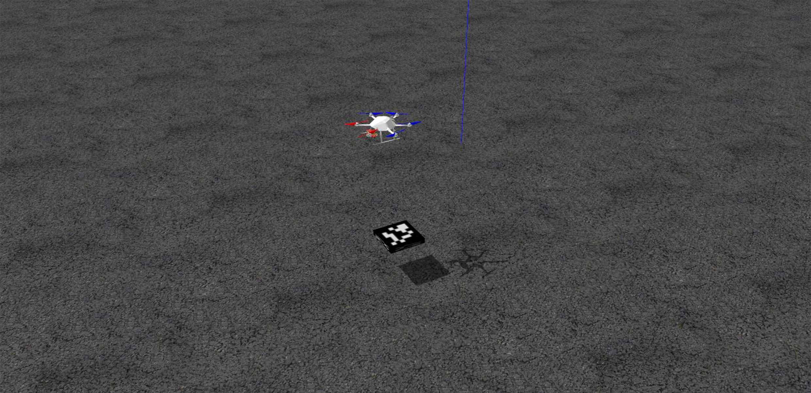

# mav_precision_landing

<p align="center">

</p>

This repository contains code for autonomous precision landing for micro aerial vehicles. It has been tested on ROS-Noetic. 

### Dependencies
1. [rotors_simulator](https://github.com/ethz-asl/rotors_simulator) by ETH-ASL
2. [opencv-contrib-python](https://pypi.org/project/opencv-contrib-python/)
3. [Klampt](http://motion.cs.illinois.edu/software/klampt/latest/pyklampt_docs/Manual-Installation.html)

## Getting Started
1. Install [rotors_simulator](https://github.com/ethz-asl/rotors_simulator) by following the instructions on the (linked) page.
2. If your local machine has opencv-python installed, then uninstall it and install [opencv-contrib-python](https://pypi.org/project/opencv-contrib-python/).
```
pip uninstall opencv-python
pip install opencv-contrib-python
```
3. Install Klampt from source by following the instructions [here](https://github.com/krishauser/Klampt/blob/master/Cpp/docs/Tutorials/Install-Linux.md).
4. Create a folder for your catkin workspace
```
mkdir -p <YOUR_WORKSPACE>/src
cd <YOUR_WORKSPACE>
catkin init
```
5. Clone this repository into the src folder of your workspace.
```
cd src
git clone https://github.com/hamdaan19/mav_precision_landing.git
```
6. Extending your workspace to the workspace where you have installed rotors_simulator.
```
cd ..
catkin config --extend ~/<PATH_TO_ROTORS_SIMULATOR_WS>/devel
```
7. Build and then source your workspace
```
catkin build
source devel/setup.bash
```
## Usage
To simulate a firefly drone moving vertically up and down over a marker to locate its position in 3D world coordinates:
```
roslaunch mav_precision_landing basic.launch
```

## Citations
**rotors_simulator**
<p>Fadri Furrer, Micheal Burri, Markus Achtelik, and Roland Siegwart, "<b>RotorS---A Modular Gazebo MAV Simulator Framework in Robot Operating System (ROS): The Complete Reference (Volume 1)</b>", pages: 595--625. In "<i>Springer International Publishing</i>" 2016.</p> 
