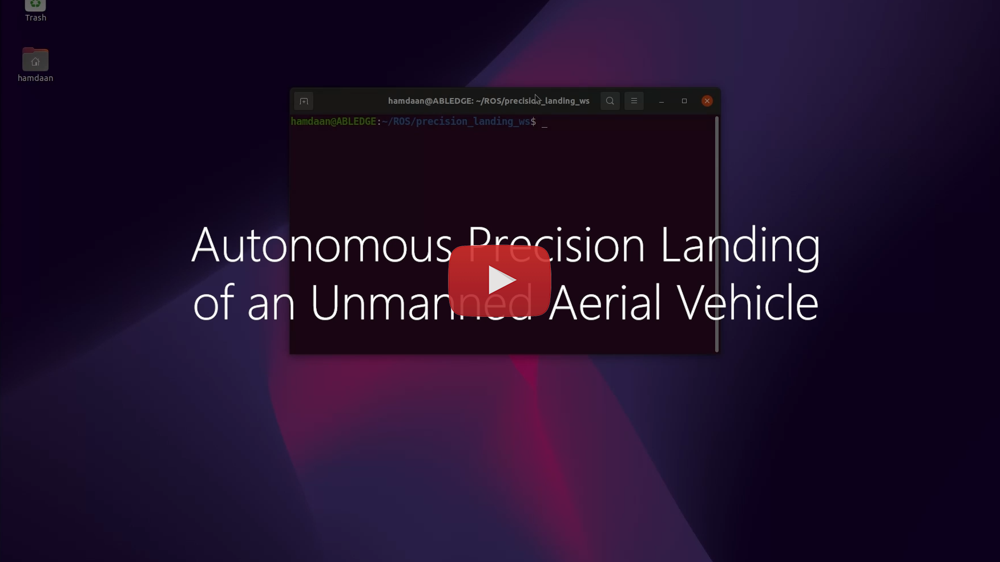

# mav_precision_landing


This repository contains code for autonomous precision landing for Unmanned Aerial Vehicles. It has been simulated and tested on ROS-Noetic with the help of RotorS Simulator developed by ETH-ASL. The framework works on the basis of detecting an AR marker in the vicinity, estimating the position of the marker and finally planning its approach for landing.   

### Demo Video

<p align="center">
  <a href="https://www.youtube.com/watch?v=2M5zyiu5pnA"></a>
</p>

## Dependencies
1. [rotors_simulator](https://github.com/ethz-asl/rotors_simulator) by ETH-ASL
2. [opencv-contrib-python](https://pypi.org/project/opencv-contrib-python/)
3. [Klampt](http://motion.cs.illinois.edu/software/klampt/latest/pyklampt_docs/Manual-Installation.html)
4. [stereo_image_proc](http://wiki.ros.org/stereo_image_proc)

## ArUco Tags
These are fiducial markers used for the purpose of camera pose estimation. The framework developed uses ArUco markers for detection and landing. It contains an array of binary sqaures (black or white) and encodes a number. Each marker can be uniquely identified using this encoded number. They are most commonly used for augmented reality and related applications. 

<p align="center">
  
</p>

## Getting Started
1. Install [rotors_simulator](https://github.com/ethz-asl/rotors_simulator) by following the instructions on the (linked) page.
2. If your local machine has opencv-python installed, then uninstall it and install [opencv-contrib-python](https://pypi.org/project/opencv-contrib-python/).
```
pip uninstall opencv-python
pip install opencv-contrib-python
```
3. Install Klampt from source by following the instructions [here](https://github.com/krishauser/Klampt/blob/master/Cpp/docs/Tutorials/Install-Linux.md).
4. Create a folder for your catkin workspace
```
mkdir -p <YOUR_WORKSPACE>/src
cd <YOUR_WORKSPACE>
catkin init
```
5. Clone this repository into the src folder of your workspace.
```
cd src
git clone https://github.com/hamdaan19/mav_precision_landing.git
```
6. Extending your workspace to the workspace where you have installed rotors_simulator.
```
cd ..
catkin config --extend ~/<PATH_TO_ROTORS_SIMULATOR_WS>/devel
```
7. Build and then source your workspace
```
catkin build
source devel/setup.bash
```
## Usage
To run a basic simulation of a Firefly drone performing autonomous precision landing:
```
roslaunch mav_precision_landing basic.launch
```
### Note
* In the following file <b>rotors_simulator/rotors_description/urdf/mav_with_vi_sensor.gazebo</b> change line 33 to this `"<origin xyz="0.1 0.0 -0.03" rpy="0.0 1.55 0.0" />"` This changes the orientation of the [VI-Sensor](https://github.com/ethz-asl/libvisensor) from front-facing to down-facing. 

## Citations
**rotors_simulator**
<p>Fadri Furrer, Micheal Burri, Markus Achtelik, and Roland Siegwart, "<b>RotorS---A Modular Gazebo MAV Simulator Framework in Robot Operating System (ROS): The Complete Reference (Volume 1)</b>", pages: 595--625. In "<i>Springer International Publishing</i>" 2016.</p> 
